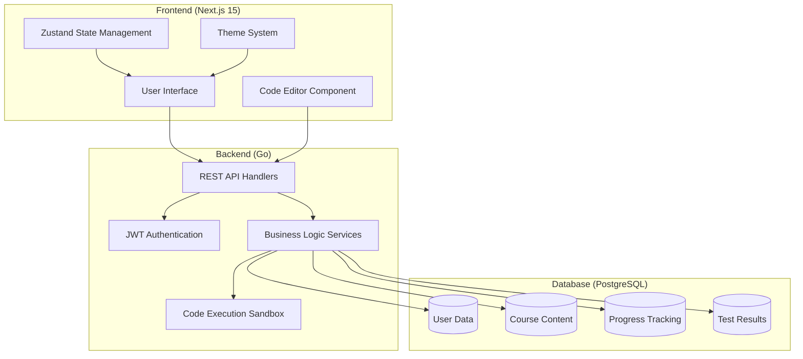
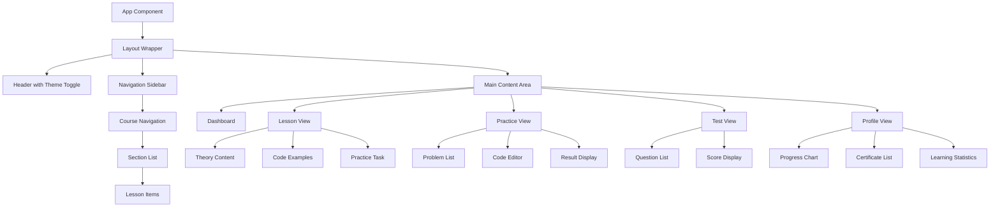

# Educational Go Programming Platform Design

## Overview

The Educational Go Programming Platform is a comprehensive web-based learning system specifically designed for teaching the Go programming language in Russian. The platform combines structured theoretical learning, hands-on practice, automated testing, and gamification elements through a points and certification system.

### Core Objectives
- Provide structured Go programming education in Russian language only
- Enable interactive learning through code execution and practical assignments
- Implement automated assessment and progress tracking
- Gamify the learning experience with points, levels, and certificates
- Support both light and dark themes with responsive design

### Target Users
- Beginner Go developers
- Students learning programming fundamentals
- Professionals transitioning to Go from other languages

## Technology Stack & Dependencies

### Frontend Technology Stack
- **Framework**: Next.js 15 with TypeScript
- **Styling**: Tailwind CSS for responsive design
- **UI Components**: shadcn/ui component library
- **State Management**: Zustand for application state
- **Directory Structure**: src/ based organization
- **Theme Support**: Dark theme (default) with light theme toggle
- **Configuration**: .env files for environment variables

### Backend Technology Stack
- **Language**: Go
- **Authentication**: JWT with dual-token system (access + refresh tokens)
- **Database**: PostgreSQL with GORM ORM
- **Architecture**: RESTful API design
- **Configuration**: .env files for environment settings

## Architecture

### System Architecture Overview



### Component Architecture

#### Frontend Component Hierarchy



#### Core Component Definitions

**Layout Components**
- `Header`: Contains logo, user menu, theme toggle, and navigation
- `Sidebar`: Hierarchical course navigation with sections and lessons
- `ThemeProvider`: Manages light/dark theme state and CSS variables

**Learning Components**
- `LessonView`: Displays theory, code examples, and embedded practice
- `CodeEditor`: Monaco-based editor with Go syntax highlighting
- `CodeRunner`: Handles code execution requests and result display
- `PracticeTask`: Individual coding challenges with auto-validation

**Assessment Components**
- `TestQuestion`: Multiple-choice question with answer validation
- `ProgressTracker`: Visual progress indicators and statistics
- `CertificateGenerator`: PDF certificate creation and download

**State Management Architecture**

```typescript
// Zustand Store Structure
interface AppState {
  // Authentication
  user: User | null;
  isAuthenticated: boolean;
  
  // Theme
  theme: 'light' | 'dark';
  
  // Learning Progress
  currentCourse: Course | null;
  currentLesson: Lesson | null;
  userProgress: Progress;
  
  // Practice
  currentProblem: Problem | null;
  submissionResult: SubmissionResult | null;
  
  // Actions
  setUser: (user: User) => void;
  toggleTheme: () => void;
  updateProgress: (progress: Progress) => void;
  submitCode: (code: string) => Promise<void>;
}
```

## API Endpoints Reference

### Authentication Endpoints

| Method | Endpoint | Description | Request Body | Response |
|--------|----------|-------------|--------------|----------|
| POST | `/api/auth/register` | User registration | `{email, password, name}` | `{user, accessToken, refreshToken}` |
| POST | `/api/auth/login` | User authentication | `{email, password}` | `{user, accessToken, refreshToken}` |
| POST | `/api/auth/refresh` | Token refresh | `{refreshToken}` | `{accessToken}` |
| POST | `/api/auth/logout` | User logout | `{refreshToken}` | `{success}` |

### Course Content Endpoints

| Method | Endpoint | Description | Auth Required | Response |
|--------|----------|-------------|---------------|----------|
| GET | `/api/courses` | List all courses | Yes | `Course[]` |
| GET | `/api/courses/{id}/sections` | Get course sections | Yes | `Section[]` |
| GET | `/api/lessons/{id}` | Get lesson content | Yes | `Lesson` |
| POST | `/api/lessons/{id}/complete` | Mark lesson complete | Yes | `{success, points}` |

### Practice & Testing Endpoints

| Method | Endpoint | Description | Request Body | Response |
|--------|----------|-------------|--------------|----------|
| GET | `/api/problems` | List practice problems | - | `Problem[]` |


